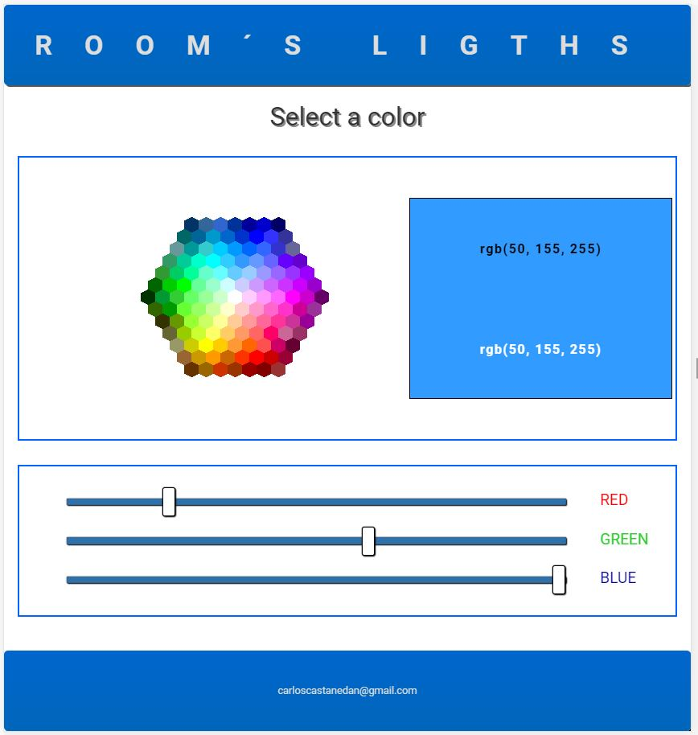

# Room´s Light

Esta aplicación fue desarrollada con la finalidad de comenzar a probar la adquisición de señales de eléctricas (provenientes de sensores) así como controlar actuadores conectados a una raspberry pi en tiempo real.

Como lenguaje de programación se eligió raspberry pi por su desempeño en aplicaciones en tiempo real.

Por lo que para el desarrollo se usaron librerías como:

-Express

-Socket-io

Para la manipulación de lo periféricos de la tarjeta se uso la librería [CylonJs](https://cylonjs.com/)

La tira de led rgb se conecta a los pines: 
Red -> 11
Grren -> 13
Blue -> 15

Si embargo esto se pude configurar en al archivo config.js

Como se muestra 
		
	
```
'use strict'
	module.exports = {	
		port: process.env.PORT || 3000,	
		led: {	
			red: 11,	
			green: 13,	
			blue: 15	
		}	
	}	
```
*Antas de conectar cualquier cosa se recomienda realizar un aislamiento galvánico de la carga con la tarjeta utilizando optoacopladores*

Interfaz de la aplicación



## Licencia

Copyright (c) 2018, Carlos Castañeda. (MIT License)
